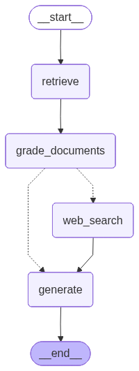

# RAG-Agent

Implementation of Reflective RAG, Self-RAG, and Adaptive RAG tailored for developers and production-oriented AI applications.

---

## Overview

RAG-Agent is an experimental and modular Retrieval-Augmented Generation (RAG) system focused on improving LLM reasoning, retrieval quality, and response reliability using advanced RAG techniques.

The project explores:
- Reflective RAG
- Self-RAG
- Adaptive RAG
- Agentic workflows
- Context-aware generation

---

## Features

- Semantic document retrieval
- Reflection-based answer refinement
- Adaptive retrieval strategies
- Self-evaluation workflows
- Modular agent architecture
- Vector database integration
- Configurable LLM support

---

## RAG Techniques

### Reflective RAG
The agent critiques and improves its own responses through iterative reasoning and reflection loops.

### Self-RAG
The model evaluates retrieval quality and determines whether additional context is required before generating the final answer.

### Adaptive RAG
Retrieval behavior dynamically changes depending on query complexity, relevance, and confidence score.

---

## Tech Stack

- Python
- LangChain / LangGraph
- OpenAI / google-genai
- ChromaDB

---

---
Inspired by recent research in:
- Self-RAG 
- Adaptive RAG
- Corrective RAG (CRAG)
- Agentic Retrieval Workflows
